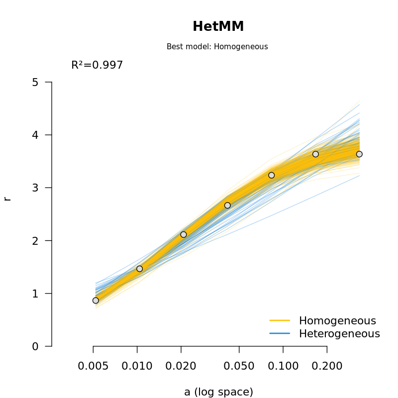

# Heterogeneous Michaelis-Menten model


The Michaelis-Menten model requires its reaction velocities to be measured from a preparation of homogeneous enzymes, with identical or near-identical catalytic activities. 
HetMM is a kinetic model that relaxes this requirement, by assuming there are an unknown number of enzyme species drawn from an unknown probability distribution.
This model features one additional parameter over the Michaelis-Menten model, describing the standard deviation of this distribution.


HetMM is a program for estimating parameters under the heterogeneous and homogeneous Michaelis-Menten models using Markov chain Monte Carlo (MCMC). 
The two models are compared and the best model, plus its posterior probability, is reported.
The Hill coefficient can also be estimated, allowing for positive or negative cooperativity between binding sites. 


HetMM is implemented as a package for BEAST 2, which is traditionally used for Bayesian phylogenetics. 
However, BEAST 2 comes with a wide range of tools that that help with Bayesian inference, and also has great support and online documentation.


## Dependencies


### Required
- BEAST 2 is required to run HetMM | https://www.beast2.org/
- R will be used for preparing the data and generating figures | https://www.r-project.org/


### Recommended
- Tracer is useful for analysing MCMC chains | https://www.beast2.org/tracer-2/


## Installing HetMM

1. Open BEAUti, which is installed with BEAST 2. If you are using the command line, this can be done using

```/path/to/beast/bin/beauti```


2. Go to File -> Manage Packages

3. Install the HetMM package. Since HetMM is currently in pre-release, you may need to add an extra package repository as follows:

  * click the `packager repositories` button. A dialog pops up.
  * click the `Add URL` button. A dialog is shown where you can enter `https://raw.githubusercontent.com/CompEvol/CBAN/master/packages-extra-2.7.xml`
  * click the `OK` button. There should be an extra entry in the list.
  * click `Done`
  * After a short delay, the HetMM package should appear in the list of packages.


4. Close BEAUti


## Using HetMM

In this tutorial we will consider the hydrolysis of sucrose by Michaelis and Menten 1913.

1. Download the example file [here](https://raw.githubusercontent.com/jordandouglas/HetMM/main/examples/MM.csv). 

2. Download the XML file template [here](https://raw.githubusercontent.com/jordandouglas/HetMM/main/examples/HetHill.xml). This file contains the full Bayesian model configuration, including parameters, prior distributions, and operators. 
   
3. Use the [csv2json.R](https://raw.githubusercontent.com/jordandouglas/HetMM/main/scripts/csv2json.R) script to convert the csv file into a json file so that it can be read in by BEAST 2:

  ```
  Rscript csv2json.R MM.tsv
  ```

This will generate a file called `MM.json`.

Note that the first time you use R, you may need to select a mirror to install packages from. This can be done by:

  ```
  # Open R
  R

  # Request to install a package, then follow the instructions to select a mirror
  install.packages("jsonlite")

  # Confirm the package was successfully installed
  library(jsonlite)

  # Quit R
  q() 
  ```


4. Run BEAST 2 on the XML file from the command line using:
  ```/path/to/beast/bin/beast -df MM.json HetHill.xml```

5. Now, BEAST should start running. On the sucrose dataset, it should take around 20 minutes to complete but you can proceed to the next step while you wait.

6. To diagnose the MCMC chain and understand its parameters, open Tracer and open `HetHill.log`. Ensure that the effective sample size (ESS) of all parameters exceeded 200, and if not, the MCMC chain should be run for longer. Please see the Tracer tutorial for further details: https://beast.community/analysing_beast_output

7. The probability that the dataset is heterogeneous is the mean value of the parameter called `ModelIndicator`. 0 is homogeneous, 1 is heterogeneous.

8. The distribution of Hill coefficient directions is under the parameter `HillIndicator`. -1 is negative cooperativity (h<1), 0 is neutral (h=1), and +1 is positive cooperativity (h>1). 

9. To visualise the model and summarise the posterior distribution, use the [plotMM.R](https://raw.githubusercontent.com/jordandouglas/HetMM/main/scripts/plotMM.R) script. From the command line this can be done using:

   ```Rscript plotMM.R HetHill.log```

   A file named HetHill.log.png should have been generated. This image will contain 1 line per sample from the MCMC chain, coloured yellow for homogeneous and blue for heterogeneous. In this case, there are a mixture of blue and yellow lines. A larger dataset typically has just 1 colour, representing higher confidence in the correct model. A summary of the inferred model parameters is also printed.


   


  ```
   Summarising posterior distribution:
   median (2.5 percentile, 97.5 percentile)
        Vmax = 3.94 (3.6, 9.99) 
          Km = 0.0207 (0.0148, 1.63) 
           ε = 0.0419 (0.0144, 0.211) 
   p(hetero) = 0.468 
     p(Hill) = 0.305 
  Best model = Homogeneous 
  ```


## Preparing your own data file

First, prepare a .csv (comma separated variable) file with two columns. The first should contain substrate concentrations, and the second with reaction velocities. Columns should be separated by commas. 


Then, use the [csv2json.R](https://raw.githubusercontent.com/jordandouglas/HetMM/main/scripts/csv2json.R) script to convert the csv file into a json file

  ```
  Rscript csv2json.R DATA.tsv
  ```

Lastly, run BEAST 2 on the newly generated `DATA.json` file
  ```/path/to/beast/bin/beast -df DATA.json HetHill.xml```


## Increasing the MCMC chain length

Open the XML file in a text editor, find the following line, and edit the value of `chainLength` accordingly.

```<run id="mcmc" spec="MCMC" chainLength="10000000">```


## Parameters


## Prior distributions


## Model averaging


## Contact

For any queries, please contact jordan.douglas@auckland.ac.nz, leave an issue on GitHub, or make a post on the BEAST user group https://groups.google.com/g/beast-users


## References

